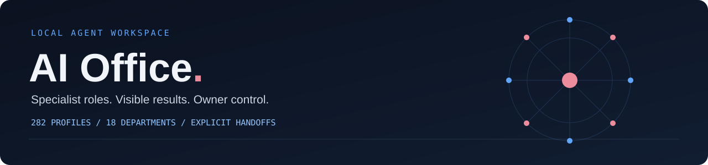
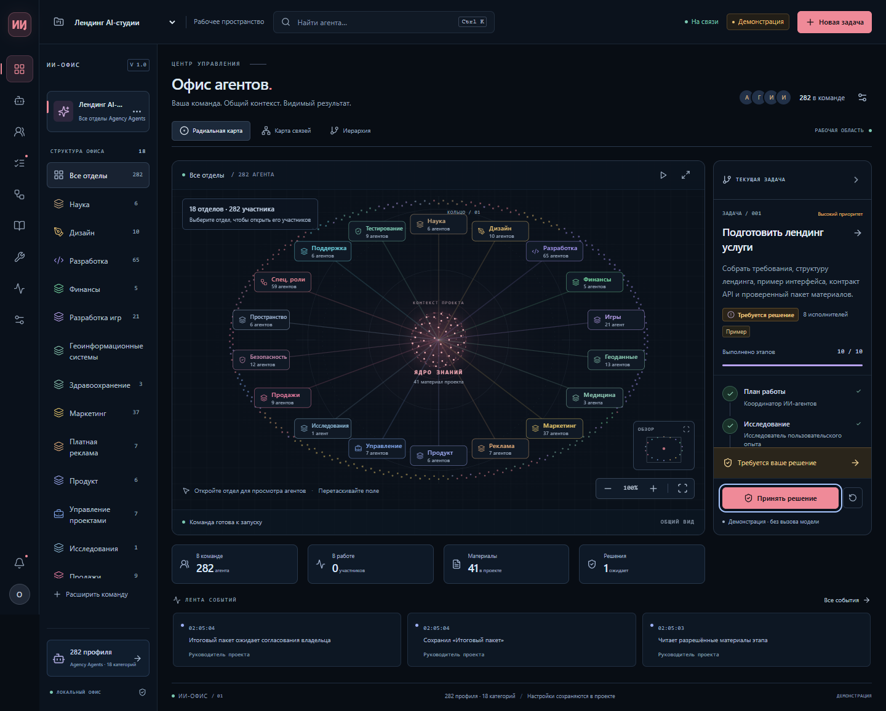
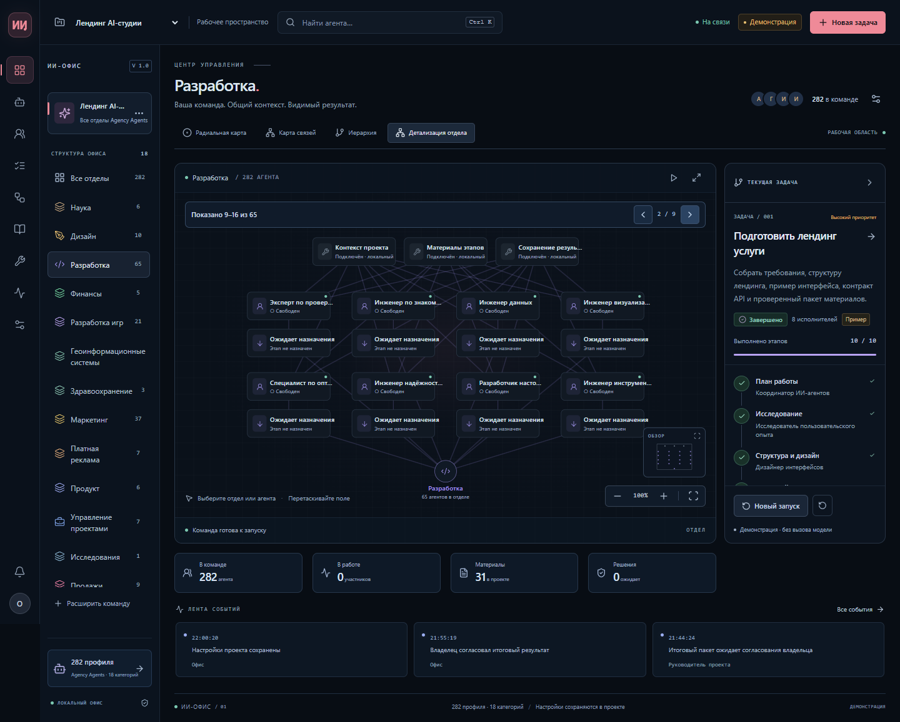
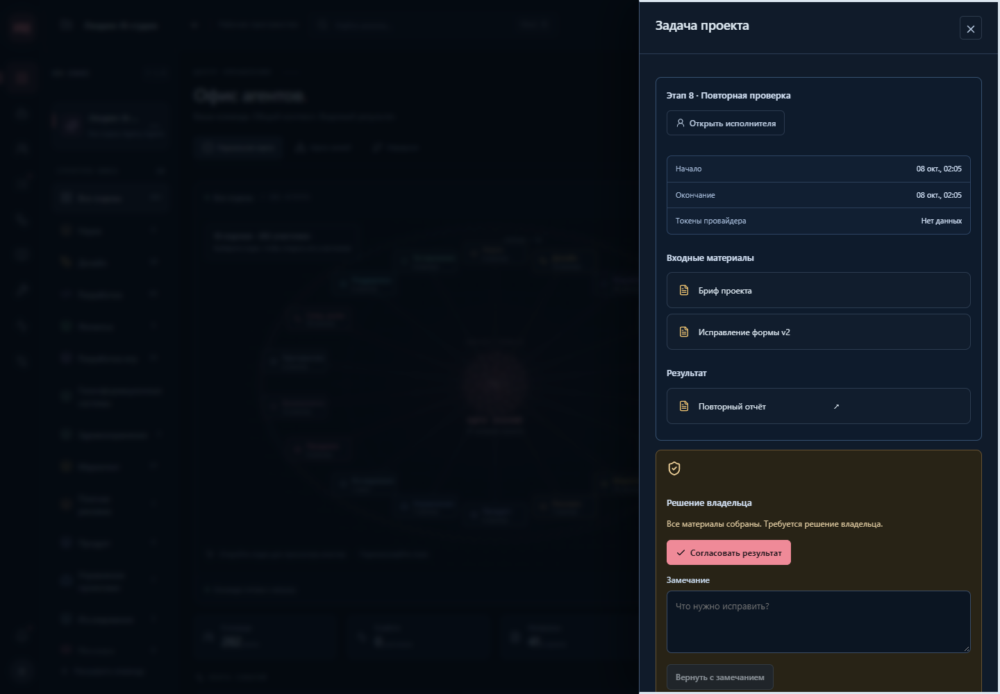
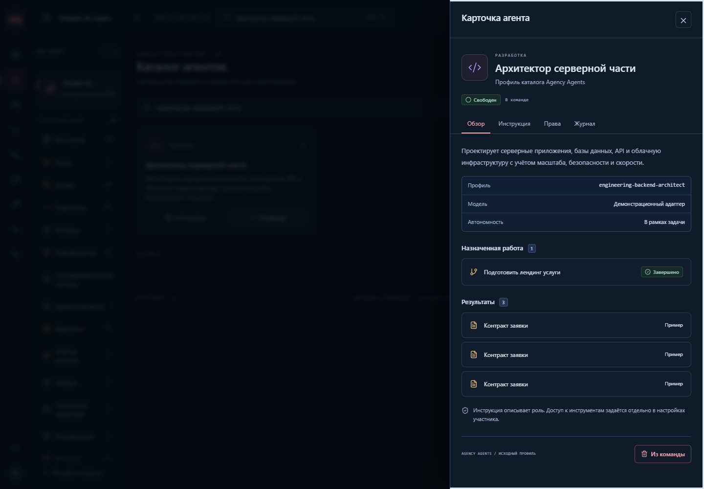
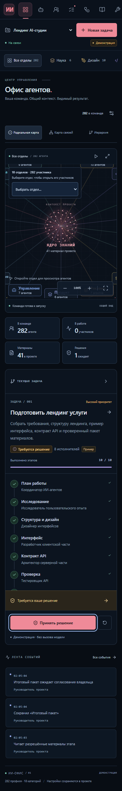
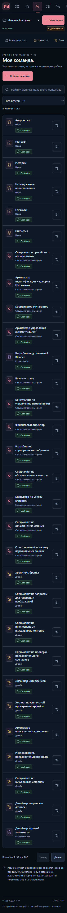
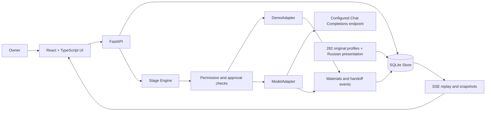

<a id="top"></a>

<div align="center">
  
  <p><strong>282 role profiles. 18 departments. Explicit handoffs. One owner in control.</strong></p>

  <a href="https://www.python.org/"></a>
  <a href="https://fastapi.tiangolo.com/"></a>
  <a href="https://react.dev/"></a>
  <a href="https://www.typescriptlang.org/"></a>
  <a href="https://www.sqlite.org/"></a>
  <br />
  
  
  
  
  
  <br />
  
  
  <a href="https://github.com/nifontovoleg/ai-office/actions/workflows/ci.yml"></a>

  <p><a href="#quick-start">Quick start</a> · <a href="#screenshots">Screenshots</a> · <a href="docs/ARCHITECTURE.md">Architecture</a> · <a href="docs/API.md">API</a> · <a href="docs/TESTING.md">Testing</a></p>
</div>

**AI Office** is a local web application for organizing specialist AI roles into a visible, controlled team. It brings the Agency Agents catalog, project membership, staged tasks, materials, permissions, event history, and owner approvals into one workspace.

The application interface, role names, and role descriptions are in Russian. Repository documentation and programming identifiers are in English. Original catalog records and Markdown instructions are retained as source material with SHA-256 provenance; localized presentation is stored separately.

> The default executor is a deterministic demonstration adapter. It creates clearly marked examples without calling a model. A server-configured Chat Completions adapter is implemented and tested with a simulated HTTP transport; live provider access is a separate setup step.

---

## Why this exists

A collection of prompts becomes useful when each role has a clear assignment, an allowed context, a concrete result, and a visible next step. AI Office makes that workflow inspectable: who is on the team, which stage is running, what was handed over, and which decision still belongs to the owner.

The catalog, project team, and task executors are separate. Adding 282 roles to a project does not pretend that all 282 are running. The included demonstration uses eight assigned specialists across ten stages.

## What the application does

| Capability | Current behavior |
| --- | --- |
| **Complete catalog** | 282 original profiles in 18 categories, searchable by Russian display name, original name, ID, and description |
| **Project teams** | Fresh primary office includes all 282 roles; additional projects start with eight specialists |
| **Safe bulk addition** | Add every catalog role while preserving existing member settings; repeating the operation adds no duplicates |
| **Visual office** | Radial department map, relationship graph, hierarchy, and department detail |
| **Large-team navigation** | Team pages of 30; department pages of eight; mobile department selector and search |
| **Role cards** | Russian names and descriptions, original instruction, assignments, materials, permissions, and journal |
| **Staged tasks** | Goal, priority, selected materials, executor order, stage titles, completion criteria, and optional schedule |
| **Explicit handoffs** | A stage consumes permitted project materials and the previous result, then stores its own output |
| **Owner decisions** | Per-stage confirmation and final acceptance or revision |
| **Persistent history** | SQLite projects, membership, tasks, materials, settings, run history, and unique events |
| **Live events** | Server-sent events with sequence cursors, reconnect snapshots, replay, and client deduplication |
| **Controlled execution** | Demo adapter by default; optional model adapter; permission rechecks, cancellation, and restart recovery |

## Screenshots

### Full office: 282 participants and 18 departments



### Engineering department



### Task results and owner review



### Russian role descriptions



<details>
<summary><strong>Mobile office and searchable team</strong></summary>




</details>

Screenshots show the Russian interface and demonstration materials. They document the application itself; the landing-page example inside the workflow is not a deployed website.

---

## Quick start

### Windows

```powershell
git clone https://github.com/nifontovoleg/ai-office.git
cd ai-office
.\START.cmd
```

`START.cmd` creates a local virtual environment and installs the pinned Python requirements on the first run. Python 3.11+ and an internet connection for the first installation are required. The built React UI is included, so Node.js is optional for normal use.

Open **http://127.0.0.1:4197/**. Keep the server window open; use Ctrl+C to stop it. The original Russian launchers remain available as aliases.

### Linux or macOS

```bash
git clone https://github.com/nifontovoleg/ai-office.git
cd ai-office
python3 -m venv .venv
source .venv/bin/activate
python -m pip install -r requirements.txt
python -m uvicorn backend.main:app --host 127.0.0.1 --port 4197
```

| Address | Purpose |
| --- | --- |
| `http://127.0.0.1:4197/` | Application |
| `http://127.0.0.1:4197/docs` | Interactive API documentation |
| `http://127.0.0.1:4197/api/health` | Executor and server health |

### Docker Compose

```bash
docker compose config --quiet
docker compose up --build
```

The port is published only on `127.0.0.1:4197`; SQLite persists in the `office-data` volume. The image uses a separate frontend build stage and an unprivileged runtime user. Local validation covered Compose configuration; the Docker Engine was unavailable for a local container run. See [configuration](docs/CONFIGURATION.md).

## Try the included workflow

1. Open the office and select the landing-page preparation task.
2. Start the demonstration. Pause automatic execution to inspect individual steps.
3. Watch the sequence: plan → research → design → interface → API contract → test → fix → retest → readiness review → final package.
4. Inspect the concrete revision: a missing visible field label is identified, corrected, and checked again.
5. Open the final owner decision. Accept the examples or return the package with a specific comment.

A manual step first starts a stage, and the next step completes it and hands over its output. Reset creates a new run while retaining completed materials and previous run history. The main office has 282 participants, but only the eight assigned specialists execute this demonstration.

## Architecture



The engine sends one current role instruction to the adapter. It does not merge all catalog prompts. External browser and GitHub tool integrations are displayed as disconnected; granting a role permission does not connect or execute them.

Detailed contracts: [architecture](docs/ARCHITECTURE.md) · [API](docs/API.md) · [model configuration](docs/CONFIGURATION.md).

## Testing and evidence

```powershell
.\.venv\Scripts\python.exe -m unittest discover -s tests -v
cd frontend
npm ci
npm run build
npm run test:e2e
npm run test:all-agents
npm run test:localization
```

Run browser tests against a running server. They create separate QA projects and exercise the primary demo; use an isolated `OFFICE_DATA_DIR` for repeated testing.

| Evidence | Recorded result before repository publication |
| --- | --- |
| Backend unit, integration, and security contracts | 45 passed, including Russian-presentation regressions |
| Original browser flow | 20 passed |
| Complete 282-member browser flow | 15 passed |
| Russian presentation browser regressions | 7 passed |
| Automated accessibility | Eleven checked states; zero violations |
| Dependency audits | Zero known npm and Python vulnerabilities in the recorded audit |
| Responsive layout | Desktop 1440 px and mobile 390 / 320 px checked |

Current logs and limitations are in [VALIDATION.md](VALIDATION.md). The [CI workflow](.github/workflows/ci.yml) runs the build, backend tests, dependency audits, and Compose configuration on GitHub. Browser checks are reproducible locally; see [testing](docs/TESTING.md).

## Project structure

```text
ai-office/
├── backend/                 # API, SQLite store, stage engine, adapters, Russian presentation
├── frontend/
│   ├── src/                 # React and TypeScript source
│   ├── tests/               # Playwright workflows and screenshot capture
│   └── dist/                # Included production UI bundle
├── catalog/                 # Original profiles, JSON catalog, starter team
├── docs/                    # Architecture, API, setup, testing, screenshots and banner
├── tests/                   # Backend unit, integration and security contracts
├── output/                  # Recorded validation artifacts
├── reference/               # Supplied visual reference frames
├── tools/                   # Portable archive builder
├── .github/workflows/       # Continuous integration
├── .env.example             # Safe server-side configuration template
├── START.cmd / INSTALL.cmd  # English Windows entry points
├── Dockerfile / compose.yaml
└── README.md
```

## Current boundaries

This is a local application for one owner. It does not yet provide multi-user authentication, public hosting, provider billing, vector retrieval, or external tool execution. Do not expose the API publicly with the current configuration.

The model adapter has transport-level test coverage. Provider credentials, account access, actual model output, live token billing, and external integrations have not been live-tested. Demo examples are identified explicitly; failures never silently switch a model run to demo content.

## Documentation

| Document | Purpose |
| --- | --- |
| [Architecture](docs/ARCHITECTURE.md) | Components, data boundaries, lifecycle, concurrency, and event flow |
| [API](docs/API.md) | Routes, request examples, actions, response errors, and SSE |
| [Configuration](docs/CONFIGURATION.md) | Environment variables, model setup, storage, Docker, and troubleshooting |
| [Development](docs/DEVELOPMENT.md) | Frontend rebuilds, extension points, CI, and contribution workflow |
| [Testing](docs/TESTING.md) | Backend, browser, accessibility, audits, and evidence scope |
| [Security](SECURITY.md) | Local threat boundary and private vulnerability reporting |
| [Validation](VALIDATION.md) | Actual results and outstanding live-integration limits |
| [Catalog](catalog/README.md) | Source archive provenance and original-file integrity |
| [Third-party notices](THIRD_PARTY_NOTICES.md) | Catalog and reference provenance; no inferred relicensing |

## Roadmap

- Add authentication and project authorization before any shared deployment.
- Validate one real model provider with an explicit account and spending policy.
- Implement external tool adapters with server-enforced capabilities and independent contract tests.
- Add database migration/versioning and configurable retention before long-lived shared use.
- Add manual screen-reader testing and user research beyond automated accessibility checks.

## Author and access

**Oleg Nifontov** · [@nifontovoleg](https://github.com/nifontovoleg)

This repository is private. No open-source license is granted by this repository. The supplied third-party catalog and reference material retain their original rights; see [third-party notices](THIRD_PARTY_NOTICES.md).

<div align="center"><a href="#top">Back to top</a></div>
