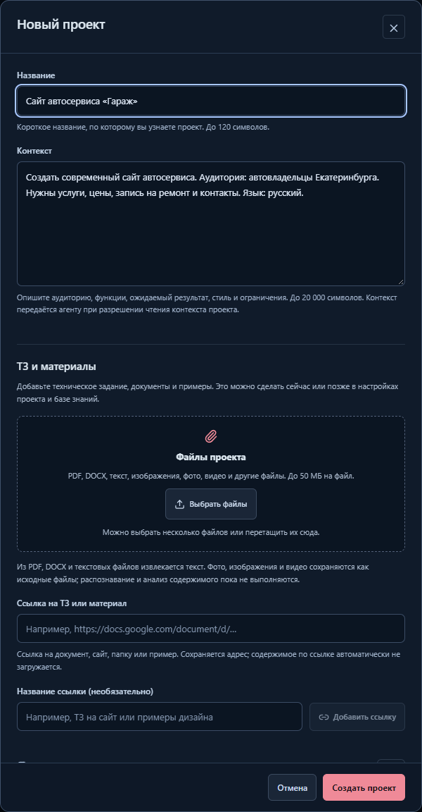
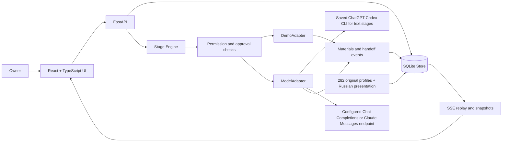

<a id="top"></a>

<div align="center">
  
  <p><strong>282 role profiles. 18 departments. Explicit handoffs. One owner in control.</strong></p>

  <a href="https://www.python.org/"></a>
  <a href="https://fastapi.tiangolo.com/"></a>
  <a href="https://react.dev/"></a>
  <a href="https://www.typescriptlang.org/"></a>
  <a href="https://www.sqlite.org/"></a>
  <br />
  
  
  
  
  
  <br />
  
  
  <a href="https://github.com/nifontovoleg/ai-office/actions/workflows/ci.yml"></a>

  <p><a href="#quick-start">Quick start</a> · <a href="#start-with-codex-and-opencode">Connect models</a> · <a href="#screenshots">Screenshots</a> · <a href="docs/ARCHITECTURE.md">Architecture</a> · <a href="docs/API.md">API</a> · <a href="docs/TESTING.md">Testing</a></p>
</div>

**AI Office** is a local web application for organizing specialist AI roles into a visible, controlled team. It brings the Agency Agents catalog, project membership, staged tasks, materials, permissions, event history, and owner approvals into one workspace.

The application interface, role names, and role descriptions are in Russian. Repository documentation and programming identifiers are in English. Original catalog records and Markdown instructions are retained as source material with SHA-256 provenance; localized presentation is stored separately.

> Fresh launches use a clearly marked demonstration until real execution is enabled. The primary real workflow uses Codex CLI with saved ChatGPT login. OpenAI-compatible Chat Completions and Claude Messages remain API alternatives; OpenCode is a separate coding session.

---

## Why this exists

A collection of prompts becomes useful when each role has a clear assignment, an allowed context, a concrete result, and a visible next step. AI Office makes that workflow inspectable: who is on the team, which stage is running, what was handed over, and which decision still belongs to the owner.

The catalog, project team, and task executors are separate. Adding 282 roles to a project does not pretend that all 282 are running. The included demonstration uses eight assigned specialists across ten stages.

## What the application does

| Capability | Current behavior |
| --- | --- |
| **Complete catalog** | 282 original profiles in 18 categories, searchable by Russian display name, original name, ID, and description |
| **Project teams** | Fresh primary office includes all 282 roles; additional projects start with eight specialists |
| **Safe bulk addition** | Add every catalog role while preserving existing member settings; repeating the operation adds no duplicates |
| **Visual office** | Radial department map, relationship graph, hierarchy, and department detail |
| **Large-team navigation** | Team pages of 30; department pages of eight; mobile department selector and search |
| **Role cards** | Russian names and descriptions, original instruction, assignments, materials, permissions, and journal |
| **Staged tasks** | Goal, priority, selected materials, executor order, stage titles, completion criteria, and optional schedule |
| **Explicit handoffs** | A stage consumes permitted project materials and the previous result, then stores its own output |
| **Owner decisions** | Per-stage confirmation and final acceptance or revision |
| **Persistent history** | SQLite projects, membership, tasks, materials, settings, run history, and unique events |
| **Client briefs and files** | Multi-file uploads and URLs at creation or later; bounded PDF/DOCX/text extraction, original downloads and supported media previews |
| **Live events** | Server-sent events with sequence cursors, reconnect snapshots, replay, and client deduplication |
| **Controlled execution** | Demo adapter by default; optional model adapter; permission rechecks, cancellation, and restart recovery |

## Screenshots

Project names/context have examples and persistent hints. Add a client brief under **New project → Brief and materials**, or later in **Settings / Knowledge base**. Originals up to 50 MiB are saved locally; readable PDF, DOCX and text files expose extracted requirements to explicitly selected task sources. Images/videos remain file references for text stages, and URL content is not fetched. See the complete [project materials guide](docs/ATTACHMENTS.md).



### Full office: 282 participants and 18 departments


### Engineering department


### Task results and owner review


### Russian role descriptions


<details>
<summary><strong>Mobile office and searchable team</strong></summary>


</details>

Screenshots show the Russian interface and demonstration materials. They document the application itself; the landing-page example inside the workflow is not a deployed website.

---

## Quick start

### Windows

```powershell
git clone https://github.com/nifontovoleg/ai-office.git
cd ai-office
.\START.cmd
```

`START.cmd` creates a local virtual environment and installs the pinned Python requirements on the first run. Python 3.11+ and an internet connection for the first installation are required. The built React UI is included, so Node.js is optional for normal use.

Open **http://127.0.0.1:4197/**. Keep the server window open; use Ctrl+C to stop it. The original Russian launchers remain available as aliases.

### Linux or macOS

```bash
git clone https://github.com/nifontovoleg/ai-office.git
cd ai-office
python3 -m venv .venv
source .venv/bin/activate
python -m pip install -r requirements.txt
python -m uvicorn backend.main:app --host 127.0.0.1 --port 4197
```

| Address | Purpose |
| --- | --- |
| `http://127.0.0.1:4197/` | Application |
| `http://127.0.0.1:4197/docs` | Interactive API documentation |
| `http://127.0.0.1:4197/api/health` | Executor and server health |

### Docker Compose

```bash
docker compose config --quiet
docker compose up --build
```

The port is published only on `127.0.0.1:4197`; SQLite persists in the `office-data` volume. The image uses a separate frontend build stage and an unprivileged runtime user. Local validation covered Compose configuration; the Docker Engine was unavailable for a local container run. See [configuration](docs/CONFIGURATION.md).

## Try the included workflow

1. Open the office and select the landing-page preparation task.
2. Start the demonstration. Pause automatic execution to inspect individual steps.
3. Watch the sequence: plan → research → design → interface → API contract → test → fix → retest → readiness review → final package.
4. Inspect the concrete revision: a missing visible field label is identified, corrected, and checked again.
5. Open the final owner decision. Accept the examples or return the package with a specific comment.

A manual step first starts a stage, and the next step completes it and hands over its output. Reset creates a new run while retaining completed materials and previous run history. The main office has 282 participants, but only the eight assigned specialists execute this demonstration.

## Start with Codex and OpenCode

**Codex is the primary setup.** It uses saved ChatGPT login for office stages and a separate interactive coding session. **OpenCode defaults to free Big Pickle**, with optional ChatGPT/API access available separately. Claude Platform remains an alternative for later.

### 1. Check Codex login

```powershell
codex --version
codex login status
```

Use Codex CLI 0.147.0+. If not logged in, run `codex login`, complete ChatGPT sign-in in the browser, then check status again. The application does not copy CLI credentials into `.env`.

### 2. Configure and start the office

```powershell
if (-not (Test-Path -LiteralPath '.env')) {
    Copy-Item -LiteralPath '.env.example' -Destination '.env'
}
notepad .env
```

Set:

```dotenv
OFFICE_ENABLE_MODEL=true
OFFICE_MODEL_PROTOCOL=codex_cli
OFFICE_MODEL_NAME=
OFFICE_CODEX_TIMEOUT_SECONDS=300
```

Codex office stages require saved ChatGPT login, not `OFFICE_MODEL_KEY`. A blank model field uses the CLI default. Preserve your existing storage settings when switching an existing env file. Then run:

```powershell
.\.venv\Scripts\python.exe tools/codex.py --check
.\START.cmd
```

Open **http://127.0.0.1:4197/**, select **Настройки → Подключённая модель**, create a short one-stage task and start it explicitly. Codex returns Russian Markdown that the office stores and passes to the next role. Account model availability and Codex usage limits still apply.

### 3. Use Codex for customer code

Office stages produce materials. To edit actual project files and run tests, open a separate interactive session in an existing customer directory:

```powershell
.\.venv\Scripts\python.exe tools/codex.py --start --project 'D:\Projects\customer-app'
```

This uses workspace-write with on-request approvals. Office text stages use a temporary read-only directory with shell/apps/plugins/browser capabilities disabled.

### 4. Connect OpenCode as another coding tool

The default env template selects `OPENCODE_AUTH=free`, `OPENCODE_PROVIDER=opencode`, and **`opencode/big-pickle`** for both main and small models. No account key or ChatGPT login is required for this public free route. Run:

```powershell
npm install -g opencode-ai
.\.venv\Scripts\python.exe tools/opencode.py --check
.\.venv\Scripts\python.exe tools/opencode.py --start --project 'D:\Projects\customer-app'
```

Skip installation if the CLI is already available. The helper forces Big Pickle, restricts the provider's model picker to it, and applies the public free preset after global/project configuration. It supplies the public `public` sentinel instead of an account key and asks before edits/shell commands. Both main and internal small-model work use Big Pickle; there is no paid fallback in this preset.

[OpenCode Zen](https://opencode.ai/docs/zen/) currently lists Big Pickle as free for a limited period and states that collected data may be used to improve it. Review this condition before sending confidential customer files. Free availability and service limits can change.

Optional ChatGPT browser-login and API-key modes remain in [the complete guide](docs/CODEX.md). Interactive OpenCode sessions remain separate from automatic office execution.

See **[the complete Codex and OpenCode launch guide](docs/CODEX.md)** for installation, safe checks, model selection, limits and Linux/macOS commands.

<a id="connect-models-and-opencode"></a>

## Alternative API providers

Direct API office calls remain optional. The OpenAI setup uses **GPT-6.1 Sol**, with **GPT-6 Luna** for lightweight OpenCode work. The **Claude Platform** preset uses **Claude Sonnet 5.5 / Haiku 5.5**. **ProxyAPI** provides a separate preset for OpenAI models through its gateway.

| Connection | Local env template | Office request model |
| --- | --- | --- |
| Direct OpenAI | [`config/openai.env.example`](config/openai.env.example) | `gpt-6.1-sol` |
| OpenAI via ProxyAPI | [`config/proxyapi.env.example`](config/proxyapi.env.example) | `openai/gpt-6.1-sol` |
| Direct Claude Platform | [`config/claude.env.example`](config/claude.env.example) | `claude-sonnet-5-5` |

### 1. Create your provider key

- **OpenAI:** sign in to [OpenAI Platform](https://platform.openai.com/), select the intended project, create a key in [API keys](https://platform.openai.com/api-keys), and check API billing/model access.
- **ProxyAPI:** create a key in [ProxyAPI Console](https://console.proxyapi.ru/) and check its balance/model catalog.
- **Claude:** sign in to [Claude Platform](https://platform.claude.com/), select the intended organization, create a key in its API-key settings and check API billing/model access.

Store the selected provider's key in **`OFFICE_MODEL_KEY` in your local `.env`**. API office calls and OpenCode's `api_key` mode use that field. Keep the checked-in examples empty. These API presets have separate billing from the primary Codex/ChatGPT workflow.

### 2. Prepare `.env`

From the repository root, choose one template and copy it only when `.env` does not already exist:

```powershell
$providerTemplate = 'config/openai.env.example'  # Direct OpenAI API
# ProxyAPI: 'config/proxyapi.env.example'
# Claude:   'config/claude.env.example'
if (-not (Test-Path -LiteralPath '.env')) {
    Copy-Item -LiteralPath $providerTemplate -Destination '.env'
}
notepad .env
```

For an existing `.env`, edit the provider fields and preserve your local storage settings. The required office values are:

| Setting | OpenAI | ProxyAPI | Claude Platform |
| --- | --- | --- | --- |
| `OFFICE_MODEL_PROTOCOL` | `chat_completions` | `chat_completions` | `anthropic_messages` |
| `OFFICE_MODEL_URL` | `https://api.openai.com/v1/chat/completions` | `https://api.proxyapi.ru/v1/chat/completions` | `https://api.anthropic.com/v1/messages` |
| `OFFICE_MODEL_NAME` | `gpt-6.1-sol` | `openai/gpt-6.1-sol` | `claude-sonnet-5-5` |
| `OFFICE_MODEL_KEY` | Your OpenAI API key | Your ProxyAPI key | Your Claude Platform API key |

All presets keep `OFFICE_ENABLE_MODEL=false` initially. Set it to `true` when ready to permit office requests. `OFFICE_MODEL_MAX_TOKENS=8192` caps Anthropic output; `OFFICE_MODEL_TIMEOUT_SECONDS=120` controls the office request timeout.

### 3. Enable the model in the office

Restart `START.cmd`, open **http://127.0.0.1:4197/** and select **Настройки → Подключённая модель**. Create and explicitly start a small one-stage task. Inspect its material and reported token usage, then check the provider dashboard for actual spend.

Configured settings and `/api/health` do not verify account access. Real requests can consume your API balance. The application never silently changes a failed model run into demo output.

### 4. Optional: start OpenCode for a customer project

Install OpenCode separately with Node.js/npm, then check local settings:

```powershell
npm install -g opencode-ai
opencode --version
.\.venv\Scripts\python.exe tools/opencode.py --check
```

`--check` makes no model request and does not print the key. After the key and CLI are ready, explicitly start a session in an existing project directory:

```powershell
.\.venv\Scripts\python.exe tools/opencode.py --start --project 'D:\Projects\customer-app'
```

The launcher loads `.env` and chooses the corresponding tracked JSON configuration. Keys enter the child environment rather than command arguments or JSON. OpenCode uses the preset's main/small models and asks before edits and shell commands. The small model handles internal lightweight work, not automatic routing of office stages.

**Current boundary:** this starts a separate OpenCode coding session. AI Office stages still generate Markdown; the office does not automatically invoke OpenCode or execute external browser/GitHub tools. `--start` can incur model charges independently of the office's enable flag.

See the **[complete provider guide](docs/PROVIDERS.md)** for Linux/macOS commands, Docker settings, every variable, troubleshooting, model switching, cost controls and verification limits.

## Architecture



The engine sends one current role instruction to the adapter. It does not merge all catalog prompts. External browser and GitHub tool integrations are displayed as disconnected; granting a role permission does not connect or execute them.

Detailed contracts: [architecture](docs/ARCHITECTURE.md) · [API](docs/API.md) · [model configuration](docs/CONFIGURATION.md).

## Testing and evidence

```powershell
.\.venv\Scripts\python.exe -m unittest discover -s tests -v
cd frontend
npm ci
npm run build
npm run test:e2e
npm run test:all-agents
npm run test:localization
npm run test:attachments
```

Run browser tests against a running server. They create separate QA projects and exercise the primary demo; use an isolated `OFFICE_DATA_DIR` for repeated testing.

| Evidence | Recorded result |
| --- | --- |
| Backend unit, integration, and security contracts | 106 passed, including 22 attachment/parser regressions |
| Real Codex text-stage smoke | Passed with saved ChatGPT login and CLI default model; reported token usage captured |
| Real OpenCode Big Pickle smoke | Passed through the public free endpoint; CLI-reported cost zero |
| Original browser flow | 20 passed |
| Complete 282-member browser flow | 15 passed |
| Russian presentation browser regressions | 7 passed |
| Project files/links browser flow | 18 passed |
| Automated accessibility | Nineteen checked states; zero violations |
| Dependency audits | Zero known npm and Python vulnerabilities in the recorded audit |
| Responsive layout | Desktop 1440 px and mobile 390 / 320 px checked |

The materials update reran all backend/build checks and four browser suites on an isolated local server with models disabled. Current logs and limitations are in [VALIDATION.md](VALIDATION.md). The [CI workflow](.github/workflows/ci.yml) runs the build, backend/browser tests, empty-key provider checks, documentation/publication checks, dependency audits, and Compose configuration on GitHub. Browser checks use installed Chromium in CI and Edge locally; see [testing](docs/TESTING.md) for FFmpeg, Python and isolated-server requirements.

## Project structure

```text
ai-office/
├── backend/                 # API, SQLite store, stage engine, adapters, Russian presentation
├── frontend/
│   ├── src/                 # React and TypeScript source
│   ├── tests/               # Playwright workflows and screenshot capture
│   └── dist/                # Included production UI bundle
├── catalog/                 # Original profiles, JSON catalog, starter team
├── config/                  # API env alternatives and OpenCode JSON presets
├── docs/                    # Architecture, API, setup, testing, screenshots and banner
├── tests/                   # Backend unit, integration and security contracts
├── output/                  # Recorded validation artifacts
├── reference/               # Supplied visual reference frames
├── tools/                   # Archive builder, repository checks, Codex/OpenCode launchers
├── .github/workflows/       # Continuous integration
├── .env.example             # Safe server-side configuration template
├── START.cmd / INSTALL.cmd  # English Windows entry points
├── Dockerfile / compose.yaml
└── README.md
```

## Current boundaries

This is a local application for one owner. It does not yet provide multi-user authentication, public hosting, provider billing, vector retrieval, or external tool execution. Do not expose the API publicly with the current configuration.

The model adapter has transport-level test coverage, and a real Codex text response through saved ChatGPT login was verified. A real Big Pickle text response through OpenCode also passed with reported cost zero. Direct API providers, optional OpenCode OAuth/API login, actual customer-project tool execution and external integrations remain unverified live. Reported token counters are not a monetary bill. Demo examples are identified explicitly; failures never silently switch a model run to demo content.

## Documentation

| Document | Purpose |
| --- | --- |
| [Architecture](docs/ARCHITECTURE.md) | Components, data boundaries, lifecycle, concurrency, and event flow |
| [API](docs/API.md) | Routes, request examples, actions, response errors, and SSE |
| [Codex and OpenCode](docs/CODEX.md) | Primary saved-login workflow and customer coding sessions |
| [Configuration](docs/CONFIGURATION.md) | Environment variables, model setup, storage, Docker, and troubleshooting |
| [Provider connections](docs/PROVIDERS.md) | OpenAI, ProxyAPI, Claude Platform, local keys and optional OpenCode sessions |
| [Development](docs/DEVELOPMENT.md) | Frontend rebuilds, extension points, CI, and contribution workflow |
| [Testing](docs/TESTING.md) | Backend, browser, accessibility, audits, and evidence scope |
| [Security](SECURITY.md) | Local threat boundary and private vulnerability reporting |
| [Validation](VALIDATION.md) | Actual results and outstanding live-integration limits |
| [Catalog](catalog/README.md) | Source archive provenance and original-file integrity |
| [Third-party notices](THIRD_PARTY_NOTICES.md) | Catalog and reference provenance; no inferred relicensing |

## Roadmap

- Add authentication and project authorization before any shared deployment.
- Compare providers on real customer tasks with an explicit account and spending policy.
- Implement external tool adapters with server-enforced capabilities and independent contract tests.
- Add database migration/versioning and configurable retention before long-lived shared use.
- Add manual screen-reader testing and user research beyond automated accessibility checks.

## Author and Access

**Oleg Nifontov** · [@nifontovoleg](https://github.com/nifontovoleg)

This repository is publicly visible as part of my portfolio. No license is granted to use, copy, modify, or distribute this code: all rights reserved. If you'd like to use the project or discuss a similar build, feel free to https://t.me/olegugfv_reg59.

Third-party catalogs and reference materials retain their original rights and licenses; see the [third-party notices](THIRD_PARTY_NOTICES.md).

<div align="center"><a href="#top">Back to top</a></div>
