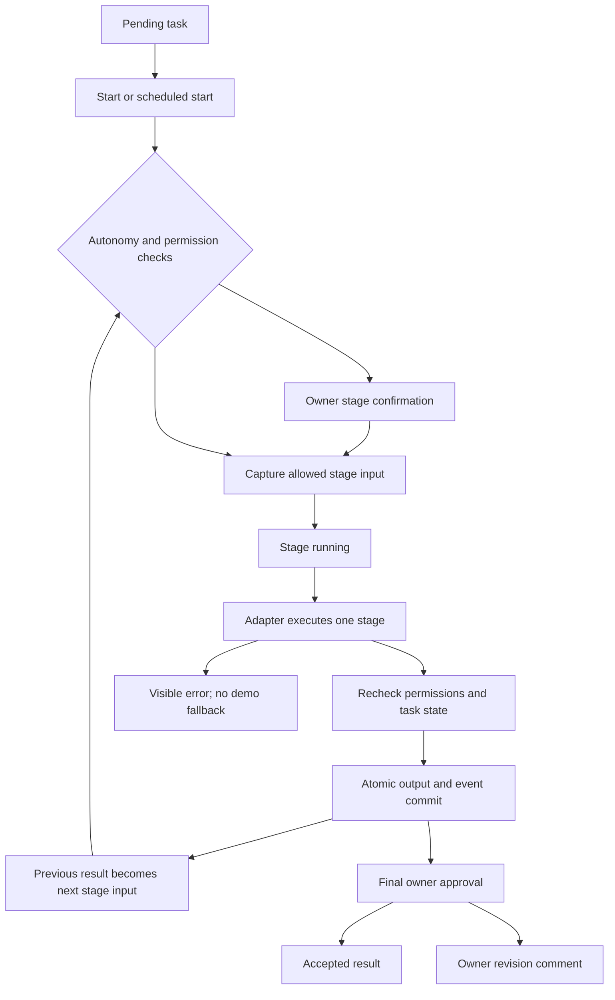

# Architecture

## Components

| Component | Responsibility |
| --- | --- |
| `backend/main.py` | FastAPI routes, typed request validation, Host/Origin guards, SSE, static UI, restart recovery |
| `backend/store.py` | SQLite persistence, validated catalog imports, project membership, transactions, events, hierarchy checks |
| `backend/localization.py` | Russian role names and concise descriptions without modifying original catalog records |
| `backend/runtime.py` | Task creation, stage snapshots, permissions, approvals, adapter calls, output commits, scheduling |
| `frontend/src/App.tsx` | Navigation, project selection, state snapshots, SSE deduplication and mutations |
| `frontend/src/Map.tsx` | Radial overview, relationship graph, department pages, hierarchy, camera and keyboard controls |
| `frontend/src/Team.tsx` | Search, category filters, membership pages and safe page correction after removal |
| `frontend/src/Panels.tsx` | Profile, task and material drawers; creation and configuration forms |

## Three separate concepts

1. **Catalog profile:** immutable source information describing a role. It is not a running process.
2. **Project member:** a profile assigned to one project with a display name, manager, autonomy mode and granted capabilities.
3. **Task stage:** an ordered assignment of a specific member to a concrete result in one run.

The first empty primary office is seeded with all 282 profiles. Other new projects start with eight roles. Existing databases preserve member edits and removals on restart. Bulk addition fills missing roles and preserves existing settings.

## Persistence

SQLite lives at `data/office.db` unless `OFFICE_DATA_DIR` overrides it. The store persists profiles, categories, projects, members, tasks, materials, events, and settings. Some domain objects are stored as JSON payloads with explicit identifiers and project keys. Database access uses internal identifiers and bound SQL values.

Catalog import validates the complete schema, categories, unique IDs and required source fields before a transactional upsert. It cannot reinterpret profile path metadata as a client-selected filesystem path. Localization is separate from `name`, `description`, `instructions_md`, paths and checksums.

## Stage execution

A manual `next` starts a pending stage; the following `next` executes and completes it. Automatic playback uses the same engine. The adapter receives the office policy, current profile instruction, project context allowed by capabilities, task goal and completion criteria, selected source materials, and the preceding stage result.

## Capabilities and concurrency

- `project_context`: permits project context and selected initial materials.
- `previous_materials`: permits the concrete preceding stage result.
- `material_export`: permits storing a stage output.
- Browser/GitHub integrations are disconnected; their presence in a role prompt does not execute tools.

Per-task locks prevent duplicate stage completion and concurrent reset. Export permissions are checked before provider execution and again before committing output. Cancellation prevents later handoffs while preserving allowed output already being produced. Membership hierarchy updates reject manager cycles under a lock.

## Adapters

`DemoAdapter` returns explicitly marked teaching examples, without usage or cost. `ModelAdapter` posts either a Chat Completions request or a native Anthropic Messages request through `httpx`, checks output and usage structure, and stores actual reported token counters. Claude cache counters are included in normalized input usage. Truncated Claude output becomes an error. Cost remains unknown without provider cost data. Invalid configuration or provider errors become visible errors. The engine does not substitute demo text after a model failure.

The model adapter generates Markdown. It does not execute returned shell commands, publish websites, browse, or push to GitHub.

`tools/opencode.py` loads a local env file and can explicitly launch a separate OpenCode process using a tracked provider preset. It is not registered in `Engine.adapter`; local config checking does not call a provider or establish live access. See [provider connections](PROVIDERS.md).

## Events and recovery

Persisted events have unique IDs and increasing sequence cursors. SSE supports replay using `Last-Event-ID` and `after`. The UI deduplicates event IDs and refreshes a snapshot after reconnecting. UTC timestamps are stored; the UI formats them for `Asia/Yekaterinburg`.

Restart pauses automatic runs and turns interrupted stages into errors that require explicit user action. A restart never silently retries a potentially paid call. Reset starts a new run and retains completed materials and history.

## Deployment boundary

One process and one local owner are the current supported scope. Authentication, tenant authorization, shared deployments, vector retrieval, real external tools and provider billing are future work. See [SECURITY.md](../SECURITY.md) for the exact local boundary.
